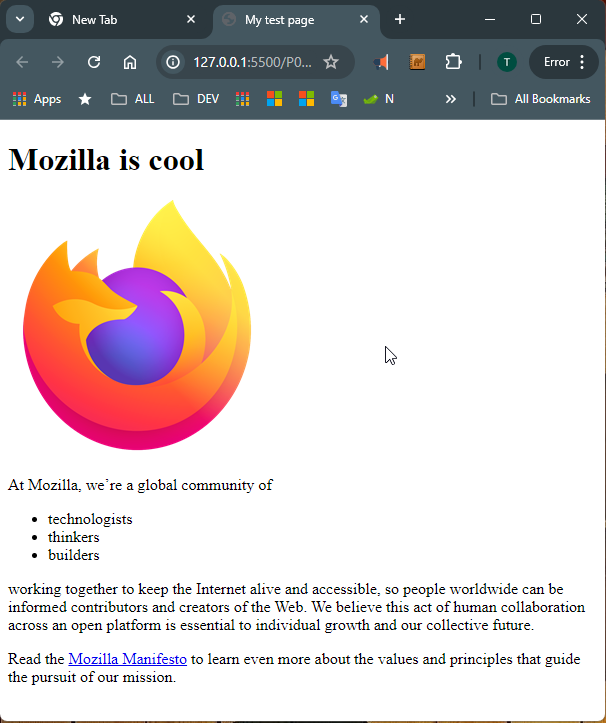
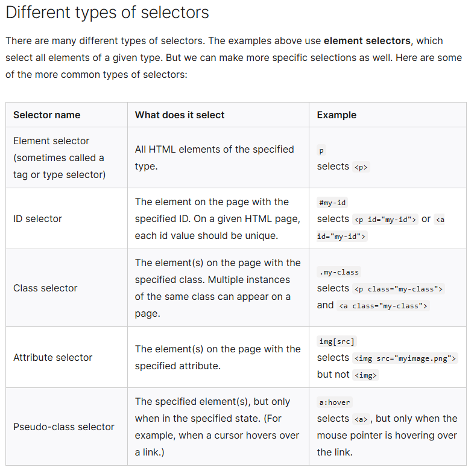
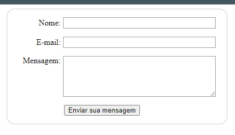
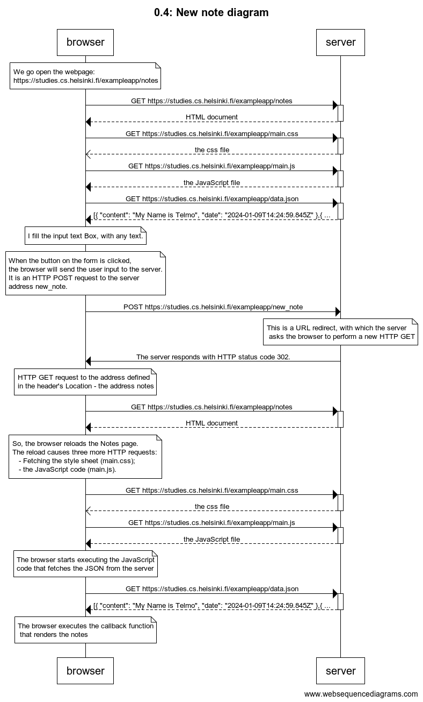
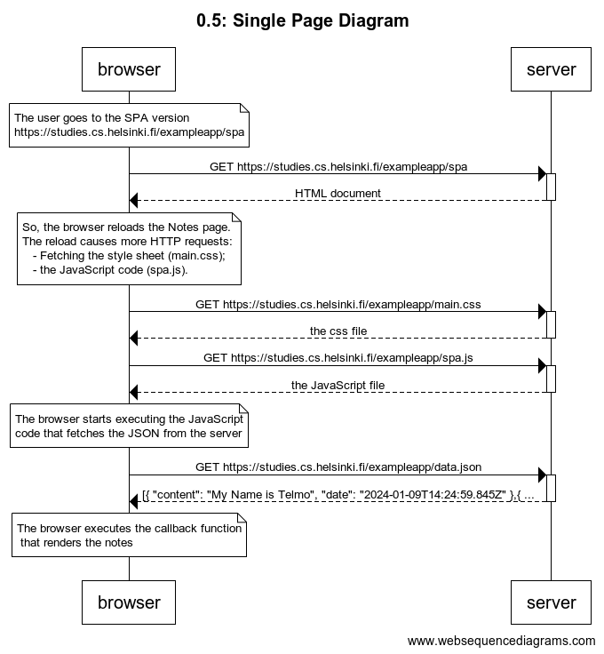
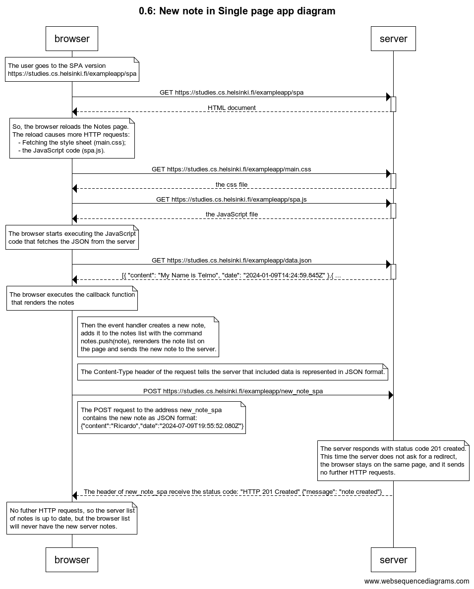

# [0.b Fundamentals of Web apps](https://fullstackopen.com/en/part0/fundamentals_of_web_apps#loading-a-page-containing-java-script-review)

## Links

Notes - Example Application: [https://studies.cs.helsinki.fi/exampleapp/](https://studies.cs.helsinki.fi/exampleapp/)
Notes - Single Page Application: [https://studies.cs.helsinki.fi/exampleapp/spa](https://studies.cs.helsinki.fi/exampleapp/spa)
Notes - Json data file: [https://studies.cs.helsinki.fi/exampleapp/data.json](https://studies.cs.helsinki.fi/exampleapp/data.json)

...

# [Exercices de 0.1 - 0.6](https://)

## 0.1: HTML

Review the basics of HTML by reading this tutorial from Mozilla: [HTML tutorial](https://developer.mozilla.org/en-US/docs/Learn/Getting_started_with_the_web/HTML_basics)

[Opeln HTML index.html](0.1_index.html)

## 0.2: CSS

Review the basics of CSS by reading this tutorial from Mozilla: [CSS tutorial](https://developer.mozilla.org/en-US/docs/Learn/Getting_started_with_the_web/CSS_basics)

There are many more selectors to discover. To learn more, see the MDN [Selectors guide](https://developer.mozilla.org/en-US/docs/Learn/CSS/Building_blocks/Selectors)

In this exercise, we have just scratched the surface of CSS. To go further, see [Learning to style HTML using CSS](https://developer.mozilla.org/en-US/docs/Learn/CSS)

[Opeln style.css](styles/style.css)

## 0.3: Formulários HTML

Learn about the basics of HTML forms by reading Mozilla's tutoria: [Your first form](https://developer.mozilla.org/en-US/docs/Learn/Forms/Your_first_form)

## 0.4: New note diagram

Create a similar diagram depicting the situation where the user creates a new note on the page [https://studies.cs.helsinki.fi/exampleapp/notes](https://studies.cs.helsinki.fi/exampleapp/notes) by writing something into the text field and clicking the Save button.

## 0.5: Single page app diagram

Create a diagram depicting the situation where the user goes to the single-page app version of the notes app at [https://studies.cs.helsinki.fi/exampleapp/spa](https://studies.cs.helsinki.fi/exampleapp/spa.)

## 0.6: New note in Single page app diagram

Create a diagram depicting the situation where the user creates a new note using the single-page version of the app.

